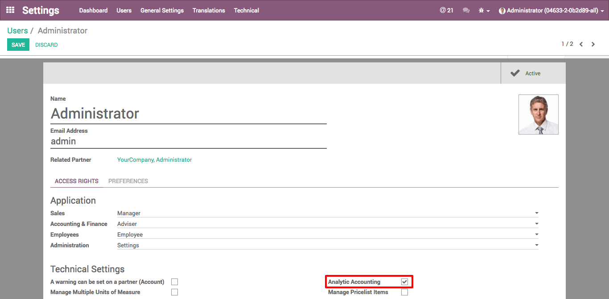

.. image:: https://img.shields.io/badge/licence-AGPL--3-blue.svg
   :target: http://www.gnu.org/licenses/agpl
   :alt: License: AGPL-3

==========================
Account analytic for Leads
==========================

This module extends the functionality of CRM leads to support the use of account analytic
and to allow you to select a account analytic for the lead.

Installation
============

To install this module, you need to:

Press the button "Install or update".

Configuration
=============

To configure this module, you need to:

* Activate the developer mode.
* Go to users and select the user that use only this field.

Usage
=====

To use this module, you need to:

* Go to a CRM.
* Create or edit a lead.

.. image:: https://odoo-community.org/website/image/ir.attachment/5784_f2813bd/datas
   :alt: Try me on Runbot
   :target: https://runbot.teleodoo.com/runbot/repo/git-github-com-telematel-prova-git-3

Bug Tracker
===========

Bugs are tracked on `GitHub Issues
<https://github.com/telematel/PROVA/issues>`_. In case of trouble, please
check there if your issue has already been reported. If you spotted it first,
help us smash it by providing detailed and welcomed feedback.

Contributors
------------

* Luis Ernesto García Medina <ernesto.garcia@telematel.com>

Do not contact contributors directly about support or help with technical issues.

Funders
-------

The development of this module has been financially supported by:

* Telematel
